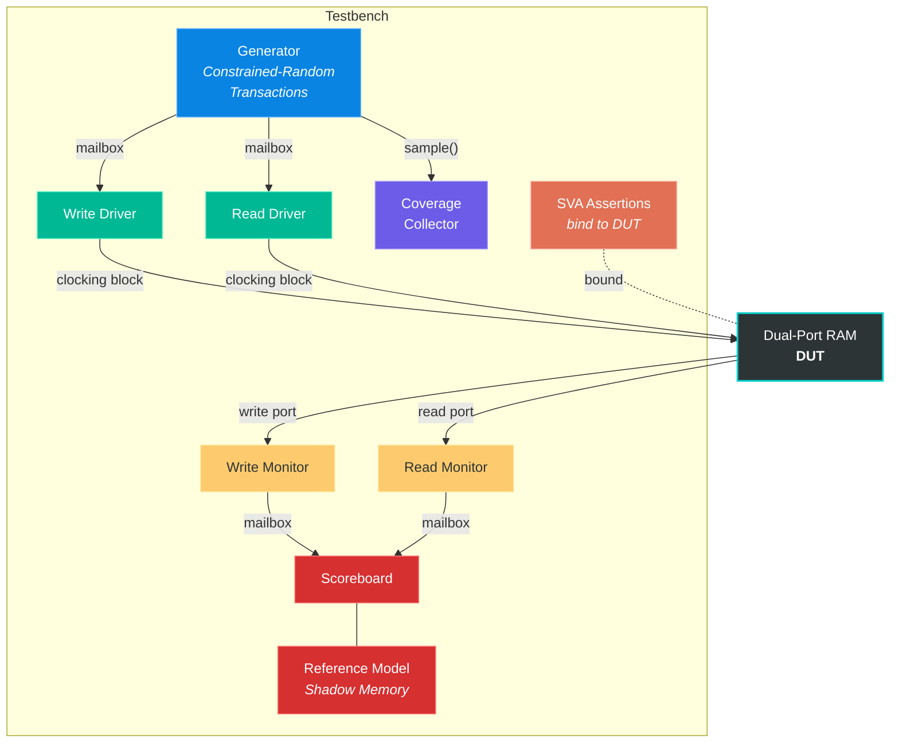

<p align="center">
  <h1 align="center">Dual-Port RAM — SystemVerilog IP Verification</h1>
  <p align="center">
    A production-grade, layered SystemVerilog verification environment for a synchronous dual-port RAM IP.
    <br />
    <a href="#architecture"><strong>Architecture »</strong></a>
    &nbsp;&middot;&nbsp;
    <a href="#verification-plan"><strong>Verification Plan »</strong></a>
    &nbsp;&middot;&nbsp;
    <a href="#getting-started"><strong>Getting Started »</strong></a>
  </p>
</p>

<p align="center">
  
  
  
  
  
</p>

---

## Table of Contents

- [Overview](#overview)
- [Design Under Test](#design-under-test)
- [Architecture](#architecture)
- [Directory Structure](#directory-structure)
- [Verification Plan](#verification-plan)
  - [Constrained-Random Stimulus](#1-constrained-random-stimulus)
  - [Self-Checking Scoreboard](#2-self-checking-scoreboard)
  - [Functional Coverage](#3-functional-coverage)
  - [SVA Assertions](#4-sva-assertions)
- [Getting Started](#getting-started)
  - [Prerequisites](#prerequisites)
  - [Running the Simulation](#running-the-simulation)
  - [Expected Output](#expected-output)
- [Configuration](#configuration)
- [Key Design Decisions](#key-design-decisions)
- [References](#references)
- [License](#license)
- [Author](#author)

---

## Overview

This repository contains a **complete, self-checking verification environment** for a parameterized synchronous **Dual-Port RAM** IP core. The testbench is built using a **layered architecture** (without UVM) and employs industry-standard verification techniques:

- **Constrained-random stimulus** with intelligent biasing and hazard avoidance
- **Reference model** with shadow memory for golden comparison
- **Functional coverage** with covergroups, cross-coverage, and corner-case bins
- **SystemVerilog Assertions (SVA)** bound to the DUT for protocol-level checks
- **Scoreboard** with pass/fail/skip classification for robust result analysis

> **Goal:** Achieve high confidence in the DUT's correctness by covering all critical operational scenarios — simultaneous read/write, address boundary conditions, data corner values, and reset behavior.

---

## Design Under Test

The DUT is a **synchronous dual-port RAM** with independent read and write ports and parameterized width/depth.

| Parameter | Default | Description |
|:---|:---:|:---|
| `ADDR_WIDTH` | 8 | Address bus width (2⁸ = 256 locations) |
| `DATA_WIDTH` | 8 | Data bus width (8-bit words) |

| Port | Direction | Description |
|:---|:---:|:---|
| `clk` | Input | System clock |
| `rst` | Input | Asynchronous active-high reset |
| `write_en` | Input | Write enable |
| `write_addr` | Input | Write address |
| `write_data` | Input | Write data |
| `read_en` | Input | Read enable |
| `read_addr` | Input | Read address |
| `read_data` | Output | Read data (1-cycle registered output) |

**Behavior:**
- **Write:** On `posedge clk`, if `write_en` is high, `write_data` is stored at `mem[write_addr]`.
- **Read:** On `posedge clk`, if `read_en` is high, `mem[read_addr]` is driven to `read_data` on the **next cycle** (1-cycle latency).
- **Reset:** Asynchronously clears all memory locations and `read_data` to `0`.

---

## Architecture



**Data Flow:**
1. **Generator** creates constrained-random `transaction` objects and distributes copies to both drivers via mailboxes.
2. **Drivers** translate transactions into pin-level activity on the DUT interface using clocking blocks.
3. **Monitors** passively observe DUT ports and forward captured transactions to the scoreboard.
4. **Scoreboard** compares DUT read output against the **reference model** (shadow memory), classifying each check as PASS, FAIL, or SKIP.
5. **Coverage** samples every generated transaction and tracks functional coverage metrics.
6. **Assertions** are bound to the DUT and continuously check protocol-level invariants.

---

## Directory Structure

```
.
├── design.sv              # RTL — Synchronous dual-port RAM
├── params.sv              # Configurable parameters (ADDR_WIDTH, DATA_WIDTH)
├── interface.sv           # SV interface with clocking blocks & modports
│
├── transaction.sv         # Randomized transaction with constraints
├── generator.sv           # Stimulus generator
├── write_driver.sv        # Write-port driver (via clocking block)
├── read_driver.sv         # Read-port driver (via clocking block)
├── write_monitor.sv       # Write-port passive monitor
├── read_monitor.sv        # Read-port passive monitor → 1-cycle latency aligned
├── reference_model.sv     # Shadow memory with write-tracking
├── scoreboard.sv          # Self-checking comparator (PASS / FAIL / SKIP)
├── coverage.sv            # Functional coverage with cross-coverage
├── assertions.sv          # SVA properties + bind to DUT
├── environment.sv         # Orchestrates all TB components
├── test.sv                # Top-level test program
├── testbench.sv           # Top-level module (clock, reset, DUT, test)
├── header.svh             # Compilation include-order header
│
├── run.sh                 # Xcelium simulation launch script
├── dump.tcl               # TCL script for VCD waveform dumping
├── .gitignore             # Excludes simulator artifacts & generated files
└── README.md              # This file
```

---

## Verification Plan

### 1. Constrained-Random Stimulus

| Constraint | Purpose |
|:---|:---|
| `c_valid_op` | At least one port (read or write) must be active per transaction |
| `c_en_dist` | Biases `write_en` at 70% to build memory state before reads |
| `c_same_addr_hazard` | Prevents simultaneous read & write to the same address (RAW hazard) |
| `c_data_corners` | Biases `write_data` toward `0x00` and `0xFF` to hit corner-case coverage bins |

### 2. Self-Checking Scoreboard

- Maintains a **reference model** with shadow memory that mirrors every DUT write.
- Tracks which addresses have been written via `addr_written[]` — reads to **unwritten addresses** are classified as **SKIP** (avoids meaningless `0 == 0` comparisons).
- Each meaningful read comparison produces a **PASS** or **FAIL** verdict.
- Final report summarizes total checks, pass/fail/skip counts, and overall verdict.

### 3. Functional Coverage

```
cg_ram_ops
├── cp_write_en          # write active / idle
├── cp_read_en           # read active / idle
├── cp_rw_combo          # CROSS: all 4 read/write enable combinations
├── cp_write_addr        # 4 bins: [0-63], [64-127], [128-191], [192-255]
├── cp_read_addr         # 4 bins: [0-63], [64-127], [128-191], [192-255]
├── cp_write_data        # Corner bins: 0x00, 0xFF, others
└── cp_addr_data_cross   # CROSS: address quartile × data corner values
```

### 4. SVA Assertions

| Assertion | Property | Severity |
|:---|:---|:---:|
| `a_reset_clears_read_data` | `read_data == 0` one cycle after `rst` asserts | Error |
| `a_write_then_read` | Data written at address A is readable one cycle after a read request to A | Error |
| `a_read_data_stable` | `read_data` holds stable when `read_en` is deasserted | Error |
| `a_no_x_write_en` | `write_en` must never be `X` or `Z` | Error |
| `a_no_x_read_en` | `read_en` must never be `X` or `Z` | Error |

> All assertions use the **`bind`** construct — they attach to the DUT without modifying RTL source code.

---

## Getting Started

### Prerequisites

| Tool | Version | Purpose |
|:---|:---|:---|
| Cadence Xcelium (`xrun`) | 25.03+ | Compilation & simulation |

### Running the Simulation

**Option 1 — Direct command:**

```bash
xrun -Q -unbuffered         \
     -timescale 1ns/1ns     \
     -sysv                  \
     -incdir .              \
     -access +rw            \
     -coverage functional   \
     design.sv testbench.sv
```

**Option 2 — Using the provided script:**

```bash
source run.sh
```

### Expected Output

```
========================================
           SCOREBOARD REPORT
========================================
  Total Meaningful Checks     : N
  PASS                        : N
  FAIL                        : 0
  SKIP (addr never written)   : N
========================================
  *** ALL MEANINGFUL TESTS PASSED ***
========================================
========================================
          COVERAGE REPORT
  cg_ram_ops coverage = XX.XX %
========================================
```

---

## Configuration

### RAM Parameters

Modify [`params.sv`](params.sv) to change the RAM dimensions:

```systemverilog
package params_pkg;
  parameter ADDR_WIDTH = 8;   // 2^8 = 256 locations
  parameter DATA_WIDTH = 8;   // 8-bit data bus
endpackage
```

### Stimulus Count

Modify the transaction count in [`test.sv`](test.sv):

```systemverilog
env.gen.gen_count = 200;   // increase for higher coverage
```

---

## Key Design Decisions

| Decision | Rationale |
|:---|:---|
| **No UVM** | Lightweight, self-contained environment for focused IP-level verification; demonstrates core verification methodology without framework overhead |
| **Separate read/write drivers & monitors** | Mirrors the independent port architecture of the DUT; enables true concurrent operation |
| **Clocking blocks with modports** | Eliminates race conditions between testbench and DUT; enforces directional signal access |
| **Write-tracking in reference model** | Prevents false-positive passes from comparing default-zero values at unwritten addresses |
| **Data corner biasing via soft constraints** | Guarantees `0x00` and `0xFF` are exercised within practical transaction counts without over-constraining the stimulus space |
| **Assertions via `bind`** | Non-invasive — RTL source remains untouched; assertions can be reused across different testbenches |

---

## References

- IEEE Std 1800-2017 — *IEEE Standard for SystemVerilog*
- *SystemVerilog for Verification* — Chris Spear & Greg Tumbush
- *Writing Testbenches: Functional Verification of HDL Models* — Janick Bergeron

---

## License

This project is provided for educational and reference purposes.

---

## Author

**Eswar Adithya**
- GitHub: [@EswarAdithya011](https://github.com/EswarAdithya011)